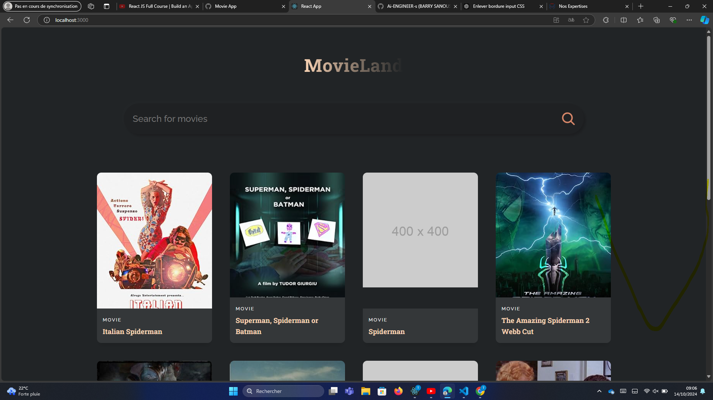

# MovieLand - Movie Search Application

MovieLand is a React-based movie search application that fetches movie data from the OMDb API. The application allows users to search for movies and view detailed information in a simple and responsive interface.

## Features

- **Movie Search**: Search for movies by title using the OMDb API.
- **Responsive UI**: Works well on both desktop and mobile devices.
- **Interactive Search**: Search results are displayed dynamically based on the search term.

## Screenshots

<!-- Add screenshots if available -->

## Installation

To get started with MovieLand locally, follow these steps:

### Navigate to the project folder :  Project_3_MovieLand_app

Install the dependencies:
bash
Copier le code
## npm install
Start the development server:
bash
Copier le code
## npm start
The app will now run on http://localhost:3000.

# API

This project uses the OMDb API to fetch movie data. You need to provide an API key to make requests.

Base URL: http://www.omdbapi.com/
Parameters:
apikey: Your API key from the OMDb API.
s: The search term (movie title).

for example : 

# http://www.omdbapi.com/?apikey=your_api_key&s=Spiderman

# Contributing
Feel free to contribute to this project by opening issues or submitting pull requests. Contributions are welcome to improve features, fix bugs, or enhance the UI/UX.

# License
This project is open source and available under the MIT License.

javascript
Copier le code

You can copy this and save it as `README.md` in your project directory.