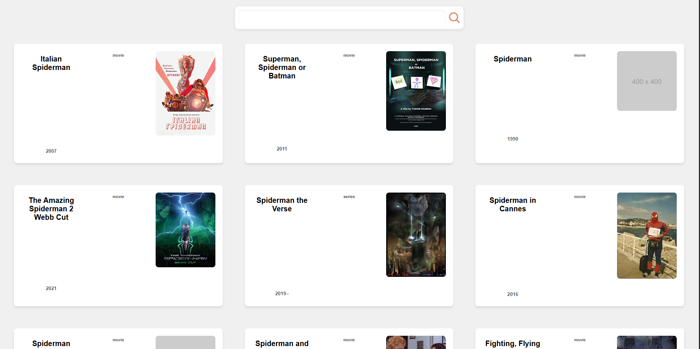

# Movie Search Application

This is a simple React application that allows users to search for movies using the OMDb API and display the results in a responsive layout.



## Features
- Search for movies by title.
- Display movie information including title, year, type, and poster.
- Fetch movie data from the OMDb API.
- Responsive design with a simple, clean layout.

## Installation

1. **Navigate to the project folder:**
    ```bash
    cd movieland
    ```

2. **Install the dependencies:**
    ```bash
    npm install
    ```

3. **Start the development server:**
    ```bash
    npm start
    ```

    The app will now run on [http://localhost:3000](http://localhost:3000).

## Usage

- Open the application in the browser and use the search bar to look for movies by title.
- The results are fetched from the OMDb API and displayed as movie cards.

## API

This project uses the [OMDb API](http://www.omdbapi.com/) to fetch movie data. You need to provide an API key to make requests.

- **Base URL:** `http://www.omdbapi.com/`
- **Parameters:**
  - `apikey`: Your API key from the OMDb API.
  - `s`: The search term (movie title).

For example:
```bash
http://www.omdbapi.com/?apikey=your_api_key&s=Spiderman
